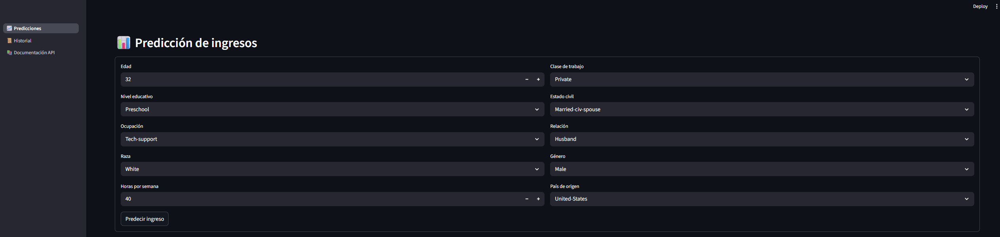

 
  
  
  ## Índice de contenidos
- [Proyecto Final - MLOps | Predicción de Ingresos con Census Income](#proyecto-final---mlops--predicción-de-ingresos-con-census-income)
  - [Descripción del Proyecto](#descripción-del-proyecto)
  - [Objetivo](#objetivo)
  - [Servicios y tecnologías](#servicios-y-tecnologías)
  - [Flujo de Trabajo](#flujo-de-trabajo)
  - [Estructura del Proyecto](#estructura-del-proyecto)
  - [Despliegue de la API](#despliegue-de-la-api)
  - [Cómo poner en marcha el proyecto](#cómo-poner-en-marcha-el-proyecto)
  - [Manual de uso](#manual-de-uso)
  - [Dataset](#dataset)
  - [Sistemas Operativos probados](#sistemas-operativos-probados)
  - [Datos](#datos)
  - [Recursos útiles](#recursos-útiles)
  - [Integrantes del equipo](#integrantes-del-equipo)
  
# Proyecto Final - MLOps | Predicción de Ingresos con Census Income

 

Este repositorio contiene el desarrollo de un proyecto completo de **Machine Learning Operations (MLOps)** cuyo objetivo fue diseñar, implementar y desplegar un pipeline automatizado para la predicción de ingresos individuales utilizando el dataset **Census Income**.  

El proyecto integra las buenas prácticas de MLOps y permite orquestar el flujo completo del ciclo de vida de un modelo de machine learning: desde el preprocesamiento de los datos, el entrenamiento del modelo, su evaluación, hasta el registro, despliegue y disponibilidad mediante una API.

Para lograr esto, se utilizan tecnologías y herramientas actuales que permiten escalar y automatizar cada etapa del proceso:

- **Apache Airflow** para la orquestación del pipeline de entrenamiento.
- **PostgreSQL** como base de datos estructurada.
- **MinIO** como sistema de almacenamiento de objetos para los datos y modelos.
- **MLflow** para el tracking, versionado y registro del modelo entrenado.
- **FastAPI** para servir el modelo como API REST y exponer predicciones en tiempo real.

---

##  Descripción del Proyecto

Se diseñó una solución de aprendizaje automático que incluye:

- Descarga y unión de datos desde MinIO.
- Análisis exploratorio de datos (EDA).
- Preprocesamiento y limpieza.
- Entrenamiento de modelos.
- Registro y versionado de modelos en MLflow.
- Exposición del modelo como API REST con FastAPI.
- Automatización de todo el flujo mediante Apache Airflow.

---

## Objetivo

Construir un pipeline de **MLOps** robusto, reproducible y automatizado que permita gestionar de manera eficiente todo el ciclo de vida de un modelo de machine learning, desde la ingestión de datos hasta su inferencia en producción.  

El proyecto integra:

- **Orquestación de tareas** con Apache Airflow.
- **Persistencia** de datos estructurados con PostgreSQL.
- **Almacenamiento distribuido** de archivos y datasets con MinIO.
- **Tracking y registro de experimentos** mediante MLflow.
- **Despliegue del modelo** en una API REST construida con FastAPI.

---

##  Servicios y tecnologías

- **Airflow**: Orquestación de los flujos de trabajo.
- **MLflow**: Tracking, registro y gestión de modelos.
- **MinIO (S3)**: Almacenamiento de datasets y artefactos.
- **PostgreSQL**: Base de datos para MLflow.
- **FastAPI**: API REST para predicciones.
- **Docker Compose**: Infraestructura contenedorizada.
- **Scikit-learn**: Modelado y evaluación.

---

##  Flujo de Trabajo

1. Airflow lee y combina `adult.csv` y `adult.test.csv` y lo carga al bucket de MinIO.
2. Se realiza la unión, análisis y preprocesamiento de los datos.
3. Se entrena un modelo Random Forest.
4. El modelo es registrado en MLflow con alias `Champion`.
5. Se expone la predicción mediante FastAPI consumiendo el modelo desde MLflow.


---

##  Estructura del Proyecto

```
.
├── airflow/
│   ├── dags/
│   ├── secrets/
│   └── datasets/
├── api/
│   ├── models/
│   ├── routers/
│   └── services/  
├── images/
├── streamlit_app/
├── dockerfiles/
│   ├── airflow/
│   ├── fastapi/
│   ├── mlflow/
│   └── postgres/
├── .gitattributes
├── .gitignores
├── mlflow.sql
├── .env
├── docker-compose.yml
├── README.md

```

---

## Despliegue de la API

El modelo entrenado se expone mediante una API REST construida con **FastAPI**, la que permite enviar datos y recibir una predicción en tiempo real.  
El servicio puede ejecutarse mediante Docker Compose.

---

##  Cómo poner en marcha el proyecto

```bash
git clone https://github.com/mbarquienero/operaciones_de_maquina_I.git
cd operaciones_de_maquina_I

# Abrir docker desktop

# Iniciar todos los servicios
docker compose --profile all up --build
```
---

## Manual de uso

1. Ingresar a Airflow y ejecutar los dags con el siguiente orden:
   - a. `upload_dataset`
   - b. `census_training_pipeline`
   - c. `deploy_model_api`
2. Ingresar a la interfaz web.
3. Seleccionar las características del individuo para la realizar la predicción.  
4. Se puede consultar en un registro histórico sobre las predcciones realizadas. 
5. Se cuenta con la documentación del servicio de la predicción. 


---
## Dataset

Se utiliza el [Census Income Dataset](https://www.kaggle.com/datasets/tawfikelmetwally/census-income-dataset/data), que contiene registros demográficos para predecir si una persona gana más o menos de 50K al año.

---

## Sistemas Operativos probados

Este proyecto fue probado exitosamente en los siguientes entornos operativos:

   - Windows 10 versión 22H2(compilación 19045).
   - Ubuntu 22.04.5 LTS (Jammy Jellyfish).
   - Windows 11 versión 24H2.

---

##  Datos

- **Airflow**:

  - http://localhost:8080/
  - user: airflow
  - pass: airflow

- **MLflow**

  - http://localhost:5000
  
- **MinIO**

  - http://localhost:9001/
  - user: minio
  - pass: minio123

- **FastAPI**

  - http://localhost:8800/
    
- **StreamLit**

  - http://localhost:8501/

---

## Recursos útiles

- [Documentación oficial de MLflow](https://mlflow.org/docs/latest/index.html)
- [Apache Airflow](https://airflow.apache.org/docs/)
- [FastAPI](https://fastapi.tiangolo.com/)
- [Scikit-learn](https://scikit-learn.org/)

[def]: #-descripción-del-proyecto

---

##  Integrantes del equipo

| Nombre Completo         |  Email                    |
|------------------------ |---------------------------|
| Mauro Barquinero        | mauro.barquinero@gmail.com|
| Mariano Campos          | lmarianocampos@gmail.com  |
| Juan Cruz Ojeda         | ojedajuancz@gmail.com     |
| Jose Luis Perez Galindo | joseperez190498@gmail.com |

